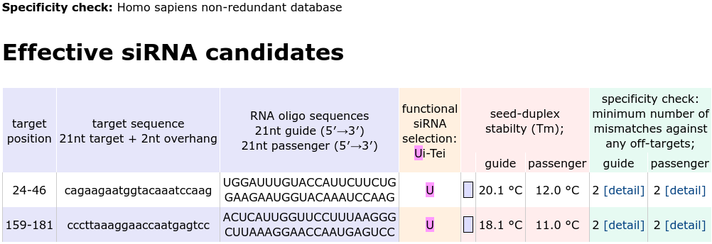
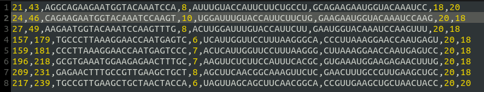

# siRNAdesigner

## Description

This is a basic siRNA designer that follows a set of rules to select and score suitable targets from the input sequence.

## Followed Rules

### Selection

1. 32% < GCpercent < 55%
2. no internal short repeats
3. no GC stretches (more than 10 GC contigous repeats)
4. 5' end of the guide RNA is A/U
5. 5' end of the passenger RNA is G/C
6. at least 4 A/U residues in the last 7bp of the 5' end of the guide
7. No G at position 13 of the passenger
8. A/U at position 19 of the passenger
9. G/C at position 19 in guide

### Score

1. 1 point if the guide starts with A, and 2 points if U
2. 1 point if the passenger 2:4 residues contain A/U, and -1 point if not
3. 1 point if the passenger first two residues are AA
4. 1 point if the passenger third residue is A
5. 1 point if the passenger tenth residue is A

### (optional) Reducing off-target effect

1. The melting temprature (Tm) of the passenger and the guide 2:8 residues are less than 21.5 degree Celesius agains a complementary off-target
2. Eliminate target sequences with more than 19 contigous bp of homology to other genes in the transcriptome

## Requirements:

The following python packages are required:

- numpy
- BioPython
- Regex

## inputs

- ### One of the following input methods:
  - #### Accession number of the gene `-a`
    NCBI accession number from the nucleotide database, Multiple accession numbers should be separated by ","
  - #### Sequence string `-s`
    concatenated exons of the gene, Multiple genes sequences should be separated by ","
  - #### Fasta file of the target gene(s) `-i`
    Fasta file path containing one targeted gene or more
- ### Reduce off targets `-t`
  default: 0 (turned off)
  1 (turned on)
- ### Transcriptome fasta file path `-f`
  used only in case reduceOffTargets is turned on
- ### Output file prefix `-o`

## Output:

- ### One CSV file

  containing those fields:

  - target starting position (1-indexed)
  - target ending position (1-indexed)
  - target sequence
  - target score
  - guide sequence
  - passenger sequence
  - guide Tm
  - passenger Tm

  in case of -i input method containing more than one target, multiple csv files will be written each named using the sequence ID from the fasta file. Otherwise, multiple inputs will correspond to multiple csv files indexed by their input order

## Running Example:

- In your Command Line environment:

> python siRNADesigner.py -s ggctgccaagaacctgcaggaggcagaagaatggtacaaatccaagtttgctgacctctctgaggctgccaaccggaacaatgacgccctgcgccaggcaaagcaggagtccactgagtaccggagacaggtgcagtccctcacctgtgaagtggatgcccttaaaggaaccaatgagtccctggaacgccagatgcgtgaaatggaagagaactttgccgttgaagctgctaactacca -t 1

- this file will be genrated:
  siRNAcandidates.csv

### Results comparison

[siDirect](https://sidirect2.rnai.jp/) result

This script result

## References:

- https://biologywise.com/types-of-gene-therapy
- https://ghr.nlm.nih.gov/primer/genomicresearch/genomeediting
- https://www.ncib.nlm.gov/pmc/articles/PMC3624098/
- https://www.ncbi.nlm.gov/pmc/articles/PMC4441801/
- http://www.genelink.com/sirna/RNAicustom.asp
- https://www.ncbi.nlm.nih.gov/pmc/articles/PMC3371628/pdf/fgene-03-00102.pdf
- http://www.protocol-online.org/prot/Protocols/
- Rules-of-siRNA-design-for-RNA-interference--RNAi--3210.html
- http://sidirect2.rnai.jp/doc/
- Hong Zhou, Xiao Zeng, Yufang Wang and Benjamin Ray Seyfarth. (2006). A Three-Phase Algorithm for Computer Aided siRNA Design. Informatica. 357–364
- http://www.biomedcentral.com/1471-2105/10/392
